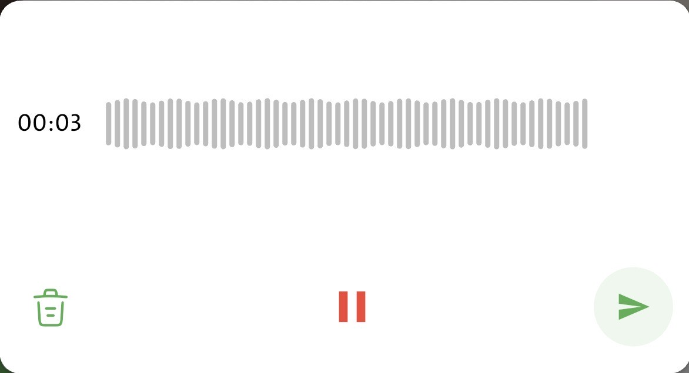
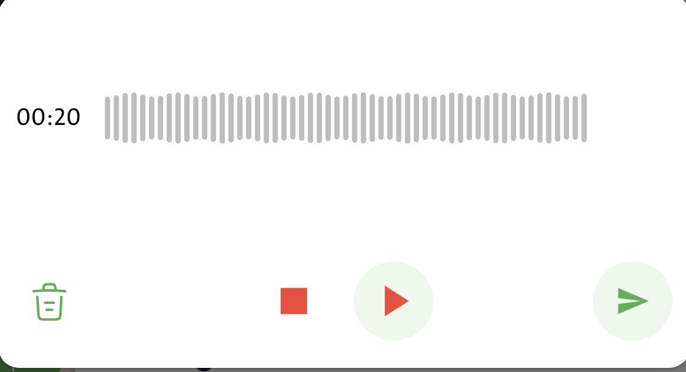
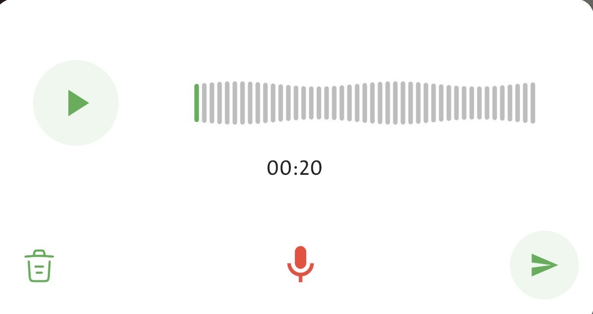

# Flutter  Recorder 🎙️

A lightweight and easy-to-use Flutter package for recording audio on Android and iOS.  
It provides a simple API to start, pause, resume, and stop audio recordings — perfect for voice notes, chat apps, and custom recording features.

---

## ✨ Features

✅ Record high-quality audio on Android & iOS  
✅ Start, pause, resume, and stop recording  
✅ Get real-time recording duration  
✅ Save files locally or in app directory  
✅ Permission handling for microphone access  
✅ Custom file naming and format options  

---

## 📸 Screenshots

Here’s how the recorder UI looks:





## 🚀 Getting Started

### 1️⃣ Add dependency

```yaml
dependencies:
  recorder:
    latest_version

## 👨‍💻 Author
**Hussain Shah**  
Flutter Developer  
[GitHub](https://github.com/shah000) 
[Email](mailto:shahjihussain42@gmail.com)
